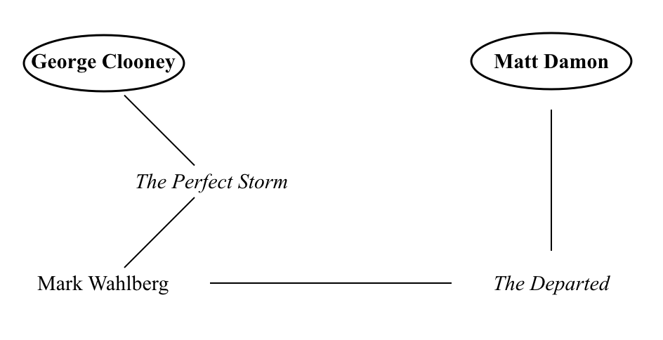

# CoStars

CoStars is a game I developed during SMU's Hackathon 2019. I came up with the general idea several years ago and this is the first time I have implemented any code to develop it.    Game idea: copyright 2017 by Jeremy Brachle

# "The Movie Game" Idea and Background:
At a holiday work party a few years ago, my manager suggested we play an icebreaker to help everyone get to know each other. Instead of the typical _throw-the-frisbee-to-someone-and have-them-say-their-name_ kinda game, someone suggested something more trivia-based. Being a group of self-proclaimed nerds and geeks (this was Hot Topic after all), we agreed. What they called the game was somewhat oxymoronic: "The Movie Game."   It was straightforward enough:

* __Player 1__ would say either the name of an actor or a movie.
* __Player 2__ would think of a movie that actor had been in or an actor in that movie, respectively.
* __Player 1 or 3__ (depending on how many players there were) would then cycle between actor/movie until a player could not think of a response.

While this was a fun party game, I craved a more rigorous test of my movie knowledge. It got me thinking about making a _new_ actor/movie game where a player would be tested on a more in-depth level of their knowledge of who acted in what and with whom than this party game.  Eventually I came up with the following idea:

# High-Level Description:
In this single player game, a player is given the names of two actors. With these two actors, they must decide if they have ever been co-stars in the same movie. If the player cannot think of at least one movie that both actors had been in or if there simply exists _no_ movie with both given actors, then they move down one level of abstraction... This is the complicated step where the true depth of the player's movie trivia is tested:  
* The player can take one given actor and select any other movie the actor has been in that the player can think of
* From this movie, the player must choose a new actor in this selected movie and think of another movie that this newly selected actor been in
* They player then works their way down until they reach a movie that contains an actor that has been costars with the other given actor
* The player could also work their way down from both given actors until they reach a common movie from their descending trees of costars

Here is an example game: 
__George Clooney__ and __Matt Damon__
1. Right away the player could say _Ocean's Eleven_ (2001)
2. However if the player didn't know both these actors were both in this movie, they could select _The Perfect Storm_ as another movie that George Clooney has starred in
3. In _The Perfect Storm_, George Clooney starred alongside Mark Wahlberg
4. Finally, Mark Wahlberg starred in _The Departed_ alongside Matt Damon

# Program Implementation
This game will be made into a mobile phone application using Ionic, a cross-platform mobile SDK, similar to Angular. In the game, the player will be given two actors and must build trees of movies and costars until the two actors are connected. Finally the player is judged on how many connections they build to combine the actors, based on a pre-calculated score of the best route. The application will pull from some movie database, either created by me or that previously exists.

# SMU Hackathon 2019 and Beyond...
My first implementation of this application will begin during SMU's 2019 Hackathon to produce a reasonably deliverable product within 24 hours. Of course, I will continue developing after this deadline to fully realize my dream of developing this game. 
